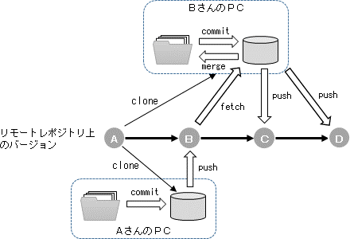

=========================
Gitでバージョンを管理する
=========================
プログラミングにおいてバージョン管理システムは必要不可欠です。バージョン管理システムを使えば、
ローカルフォルダにあるプログラムソースコードを特定のバージョンに変更することが自由自在に
できますし、特定のバージョン間でどのような変更が加えられているのか、その差分を確認することも
容易です。バージョン管理システムは作業効率向上に大きく寄与するため、慣れてしまえばそれを
使わないでプログラミングするなど考えられないほどです。ここでは、バージョン管理ソフトのうち
最もポピュラーなGitについてその概要を説明し、プログラムの管理手法の一端を紹介します。

バージョン管理システムとは
================================

バージョン管理システムとはプログラムのソースコードなどのファイルを管理するためのシステムです。
「誰が、いつ、どのような」変更を加えたのかを記録し、過去のある時点のバージョンを復元したり、
バージョンごとの差分を表示したりできます。プログラミングを行う際、人間は時々ミスを犯しますので
古いバージョンに戻れたり差分を表示できたりすると、どこで間違いがあったのかを判断するのに
役立ちます。さらに、複数の人で一つのプログラムを開発する場合を考えると、バージョン管理システム
を使うことでお互いの変更の履歴を確認し合えるため共同作業が容易になります。

また、レポジトリと呼ばれるファイルの履歴を管理する一種のデータベースのようなものを使うため、
作業フォルダ内のファイルを消してしまったり、ハードディスクドライブが壊れてしまっても、
リモートのレポジトリからファイルを復元できます。

もちろん、個人で管理する小規模なプログラムであっても、機能の異なる複数のバージョンを
作成したり、変更結果を確認しながらソースコードの修正を進める場合などにも便利です。

また、科学技術計算において新たな知見を得る場合、そのプログラムがどのバージョン
であるのか明確にし、他人が全く同じ計算を再現できるようにしておくことが大切ですので、
記憶に頼らずにしっかりとファイルを管理ができるバージョン管理システムはとても重要な役割
を担うことになります。

Git利用の準備
---------------
Gitの使い方は以下のウェブページや書籍に分かりやすく解説されています。
まだGitを使ったことがない方はこれらの文献で学習してみることをお勧めします。

- サルでもわかるGit入門 (http://www.backlog.jp/git-guide/)
- Pro Git book日本語訳 (https://git-scm.com/book/ja/v2)

ここで、Gitを使うための準備についても一言触れておきましょう。Linuxの場合は
ディストリビューションに付属する基本的なパッケージマネジメントツールを使ってインストール可能です。
Fedoraを使っているのであれば、シェルで「sudo yum install git」によってインストール可能ですし、
Debian系のディストリビューションなら「sudo apt-get install git」でインストールできます。
OS Xでは、Xcode Command Line Toolsをインストールするのが一番簡単です。Windowsでは、
git for windows（https://git-for-windows.github.io/）をインストールすれば使えます。
Windowsのファイルエクスプローラに統合してコンテキストメニュー（右クリックして出てくるメニュー）
からGitの機能にアクセスするには、
TortoiseGit（https://tortoisegit.org/）をインストールすると良いでしょう。

Gitによるバージョン管理
------------------------
Gitを使うと何ができるのか、ここでは履歴管理の観点で具体的なイメージを示します。
「図. リビジョンの進み方の例」ではＡさんとＢさんがリモートレポジトリのバージョンを進めていく
様子を示しています。この作業は次のような流れで行われています。

1. ＡさんとＢさんがレポジトリをクローン（clone）する（レポジトリのコピー）
2. Ａさんが最初のバージョンをコミット（commit）
3. Ａさんがコミットした内容をリモートレポジトリにプッシュ（push）（リモートレポジトリがＢ版になる）
4. Ｂさんがリモートレポジトリの内容をフェッチ（fetch）
5. Ｂさんがフェッチした内容をローカルファイルにマージ（merge）
6. Ｂさんがファイルを書き換えてコミット
7. Ｂさんがコミットした内容をリモートレポジトリにプッシュ（リモートレポジトリがＣ版になる）
8. Ｂさんが再度ファイルを書き換えてコミット
9. Ｂさんがコミットした内容をリモートレポジトリにプッシュ（リモートレポジトリがＤ版になる）

.. _label: gitexam

図. リビジョンの進み方の例

このようにGitを使うと複数人でプログラムのソースコードを改変しながらリビジョンを進めていくことが
できます。最初に実施する作業はリモートレポジトリの作成と、それを各自のＰＣにコピーしてくる
作業、すなわちクローン（clone）です。
次に、プログラムを改変しコミットします。コミットとは、自分の変更をローカルレポジトリに記録する処理です。
コミットは自分のＰＣのローカルリポジトリに
対して行われますから、他の共同開発者に一切の影響を与えません。コミット後に
プッシュ（push）を行うとリモートレポジトリに変更が反映されて、共同開発者に
変更内容を知らせることができます。ただし、「図. リビジョンの進み方の例」には示しておりませんが、
自分がプッシュ（push）する前に、他の誰かがすでにプッシュしていないかどうかフェッチ（fetch）
して確認しておく必要があります。フェッチ（fetch）はリモートレポジトリの改変内容を自分のローカル
レポジトリに反映する処理です。
実際、上記の例では、Ｂさんがローカルファイルの改変を行う前にフェッチ（fetch）して
Ａさんの改変内容をＢさんのローカルＰＣのレポジトリに反映させています。
そのうえでＢさんは、ローカルファイルにＡさんの変更内容をマージ（merge）
し（プル（pull）という処理をすると、フェッチに加えてマージが自動的に行われます）、
ファイルに変更を加えてコミットとプッシュをする作業を繰り返しています。
このように複数人でプログラムを共同管理しながらプロジェクトを進めることができます。

なお、リビジョン番号（Gitの場合リビジョン番号は通し番号ではなく、コミットするオブジェクト
に対するSHA-1ハッシュが割り当てられます。）
はプッシュした時点のファイル全体のセットに対して割り振らていますので、
リビジョン名を指定すれば、その時点のファイルセットを取り出すことができます。

次に、Gitで重要となるブランチの考え方を紹介します。ブランチとは、ファイルの変更履歴をある時点
から分岐させて別々に管理するためのものです。ブランチがあるおかげで、複数の機能を同時に別々に
試してみて、問題がなければリリース版となるメインのブランチ（すなわちmasterブランチ）に機能を
合流させる、というような管理の仕方が可能になります。

「図. ブランチの例」はその例を示したものです。まず、レポジトリを作成すると「master」と
呼ばれるブランチが作成されます。「図. ブランチの例」ではリモートレポジトリにmasterブランチ
だけが存在する状態を示しています。作業を行うローカルＰＣではリモートレポジトリからプルして、
ローカルレポジトリにリモートレポジトリの内容をコピーします。そして、基本的にはリリース版となる
メインのプログラムであるmasterブランチを更新していきます。「図. ブランチの例」では、
masterブランチがＢからＣ、Ｄへと更新されている様子を示しています。

ここで、masterブランチに反映しようとしている２つの機能があるとします。
その場合には、管理の流れを分岐させて「図. ブランチの例」
に示したように、例えばfunc_aブランチと
func_bブランチを作成します。そして、これらのブランチにそれぞれの機能を実装し
masterブランチに反映してよいかどうか判断します。その結果、func_aブランチの機能はmasterブランチに
反映して良いが、func_bブランチの機能はダメだと判断されたとします。その場合、
func_aブランチにコミットした機能をmasterブランチにマージして機能統合し、
func_bブランチはそこで開発を中止すれば良いのです。
そして、func_aブランチの機能を統合したmasterブランチをリモートレポジトリにpushして
作業が完了します。

本書では、Gitによる開発の進め方の一端しか紹介できませんが、様々な状況に対応できるように
Gitは多くの機能を備えています。利用に慣れてきたら徐々に高度な使い方もマスターできるように
学習してみてください。

.. image:: 2_06_branch.png
   :scale: 60 %
   :alt: ブランチの例
   :align: center

図. ブランチの例